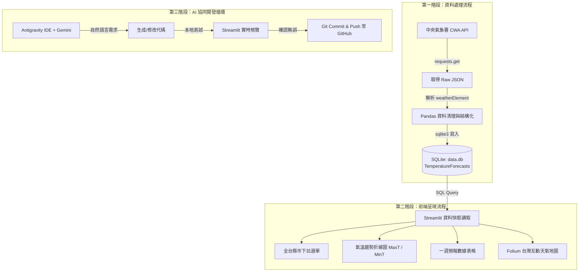

# 📋 專案開發工作流程 (Development Workflow)

> **專案名稱**：台灣天氣預報 Web 應用程式 (Taiwan Weather Forecast Dashboard)  
> **核心技術**：CWA API × SQLite × Streamlit × Folium × Antigravity (Gemini)

本工作流程整合了**課程 24 步開發技術藍圖**與 **Antigravity AI Agent 10 步 Vibe Coding 開發循環**，提供從環境建置、資料串接、資料庫設計到前端視覺化與部署的標準化指南。

---

## 🔄 全域資料與開發架構圖



---

## 🚀 階段性開發流程 (Phase by Phase)

### 階段一：開發環境建置與 API 準備 (Steps 1 ~ 4)

1. **建立 Python 虛擬環境**
   ```bash
   python -m venv venv
   # Windows PowerShell
   .\venv\Scripts\Activate.ps1
   ```

2. **安裝所需依賴**
   ```bash
   pip install -r requirements.txt
   ```

3. **取得並設定 CWA API 金鑰**
   - 登入 [中央氣象署氣象資料開放平台](https://opendata.cwa.gov.tw/)。
   - 複製會員專屬授權碼（Authorization Code）。
   - 在專案根目錄建立 `.env`（此檔案已被 `.gitignore` 排除，避免外洩）：
     ```env
     CWA_API_KEY=CWA-XXXXXXXXXXXXXXXXXXXXXXXX
     ```

---

### 階段二：API 串接與資料清洗 (Steps 5 ~ 7)

- **目標檔案**：`fetch_weather.py`
- **流程細節**：
  1. 使用 `requests.get()` 呼叫中央氣象署一般天氣預報 API（例如 36 小時預報 `F-C0032-001` 或 一週預報 `F-D0047-091`）。
  2. 檢查 HTTP 狀態碼與 JSON 回應結構。
  3. 透過迴圈提取各縣市名稱 (`locationName`)、預報時段 (`startTime`, `endTime`) 及氣溫參數（最高溫 `MaxT`、最低溫 `MinT`、天氣現象 `Wx`、降雨機率 `PoP`）。
  4. 使用 `pandas.DataFrame` 整理為結構化表格，並處理缺失值或時間格式轉換。

---

### 階段三：SQLite 資料庫模型與儲存 (Steps 8 ~ 10)

- **目標檔案**：`database.py`
- **資料表規劃**：`TemperatureForecasts`
  ```sql
  CREATE TABLE IF NOT EXISTS TemperatureForecasts (
      id INTEGER PRIMARY KEY AUTOINCREMENT,
      regionName TEXT NOT NULL,
      validDate TEXT NOT NULL,
      minT REAL,
      maxT REAL,
      weatherCondition TEXT,
      rainProbability INTEGER,
      updated_at TIMESTAMP DEFAULT CURRENT_TIMESTAMP,
      UNIQUE(regionName, validDate) ON CONFLICT REPLACE
  );
  ```
- **核心操作**：
  1. `init_db()`：自動初始化資料庫與資料表。
  2. `save_forecasts(df)`：將 Pandas DataFrame 批次寫入 SQLite，使用 UPSERT 避免重複。
  3. `get_regions()`：查詢所有可用縣市清單。
  4. `get_forecast_by_region(region_name)`：根據選擇縣市查詢預報資料。

---

### 階段四：Streamlit 互動介面開發 (Steps 11 ~ 16)

- **目標檔案**：`app.py`
- **元件規劃**：
  1. **頁面標題與指標卡片 (Metrics)**：顯示當前選擇地區的最新氣溫、天氣狀況、最高與最低溫。
  2. **地區切換器 (st.selectbox)**：提供全台縣市切換。
  3. **氣溫趨勢分析 (st.plotly_chart / st.line_chart)**：繪製未來一週最高溫與最低溫平滑折線圖。
  4. **預報明細數據 (st.dataframe)**：以美觀表格展示各時段預報，支援搜尋與下載。

---

### 階段五：進階地圖視覺化 (Steps 17 ~ 19)

- **目標檔案**：`components/map_view.py`
- **核心功能**：
  1. 整合各縣市中心點經緯度座標字典。
  2. 使用 `folium.Map(location=[23.973875, 120.982024], zoom_start=7)` 建立台灣全圖。
  3. 在各縣市標記圓點或圖標，根據氣溫高低顯示不同漸層色（例如低溫藍色、適溫綠色、高溫橙紅色）。
  4. 整合進 Streamlit：使用 `streamlit_folium.st_folium()` 進行互動嵌入。

---

### 階段六：程式碼重構、品質優化與 Git 同步 (Steps 20 ~ 24)

1. **例外狀況處理 (Error Handling)**：
   - 網路連線逾時處理 (`requests.exceptions.RequestException`)。
   - 資料庫鎖定保護與快取機制 (`@st.cache_data`)。
2. **Git 版本控制與持續推送**：
   ```bash
   # 檢查當前異動狀態
   git status

   # 加入追蹤
   git add .

   # 具備語義化的 commit
   git commit -m "feat: implement CWA API fetch and SQLite storage"

   # 推送至遠端 GitHub
   git push origin main
   ```

---

## 🛠️ 開發日常常用指令快速查閱 (Cheat Sheet)

| 動作 | 終端機指令 | 說明 |
| :--- | :--- | :--- |
| **手動更新資料庫** | `python fetch_weather.py` | 抓取最新 API 資料並寫入 SQLite |
| **啟動 Web 儀表板** | `streamlit run app.py` | 本地啟動，預設在 `http://localhost:8501` |
| **查看資料庫內容** | `sqlite3 data.db` | 進入 SQLite CLI 檢查資料表狀態 |
| **更新依賴庫清單** | `pip freeze > requirements.txt` | 記錄新加入的套件 |
| **推送至 GitHub** | `git push origin main` | 同步本地提交至遠端 |

---

## ⚠️ 開發注意事項與最佳實踐

1. **API Key 安全防護**：
   - 嚴禁將 API Key 直接 Hardcode 在程式碼並推送到公開的 GitHub 倉庫。
   - 一律使用 `.env` 搭配 `python-dotenv` 或 `st.secrets`。
2. **Streamlit 快取優化**：
   - 查詢資料庫的函式務必加上 `@st.cache_data(ttl=600)`，避免每次畫面重新渲染都重複查詢資料庫。
3. **資料重複處理**：
   - 使用 `UNIQUE(regionName, validDate) ON CONFLICT REPLACE` 確保重複執行資料抓取時只會更新、不會堆積重複歷史資料。
